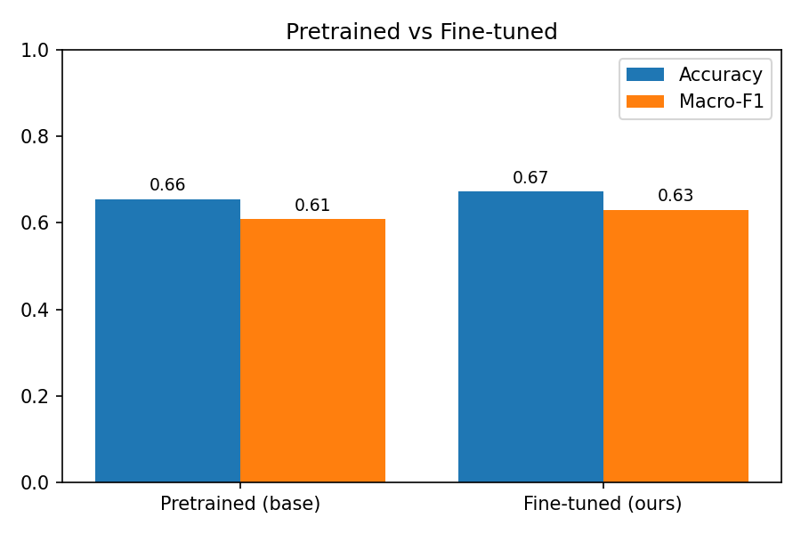
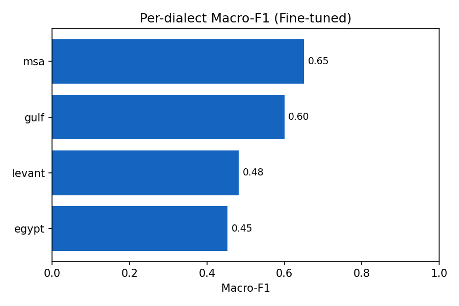
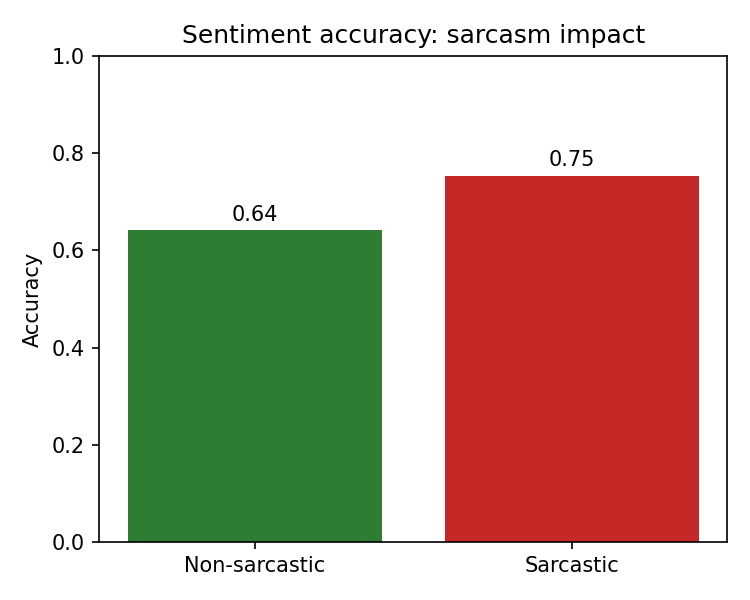

# 💬 Dialectal Arabic Sentiment Analyzer

> End-to-end Arabic NLP system that classifies **sentiment** and detects **dialect** in colloquial Arabic — the language people actually use in tweets, reviews, and feedback. Built on a **CAMeLBERT-DA transformer fine-tuned on ArSarcasm-v2**, with a full benchmark suite (pretrained vs fine-tuned, per-dialect, sarcasm analysis), a REST API, and an interactive dashboard.


<!-- After deploying, replace with your live link:
🔴 **Live demo:** https://huggingface.co/spaces/<your-username>/dialectal-arabic-sentiment-analyzer -->

---

## 🎯 The Problem

Most Arabic NLP tools are trained on **Modern Standard Arabic (MSA)** — the formal register of news. But real users write in **dialect**:

| Text | True sentiment | Typical MSA tool |
|---|---|---|
| التطبيق **مره حلو** ويجنن | Positive ✅ | Confused / Neutral ❌ |
| الخدمة **زفت** | Negative ✅ | Unknown word ❌ |

Words like *مره*, *زفت*, *يجنن* barely exist in MSA corpora. This project targets dialectal Arabic directly — and goes further by **detecting which dialect** a text is written in.

## ✨ What Makes This Project Different

1. **Real fine-tuning, measured honestly.** The base CAMeLBERT-DA model is fine-tuned on the **ArSarcasm-v2** dataset (15,548 independently-labeled tweets), and the repo includes a benchmark that proves the fine-tuning *added value* by comparing it head-to-head with the base model on the held-out test set.
2. **Dialect detection.** A separate lightweight model identifies the dialect (MSA, Egyptian, Gulf, Levantine), so each text gets *both* dialect and sentiment.
3. **Per-dialect & sarcasm analysis.** The benchmark breaks performance down by dialect and measures how much sarcasm degrades sentiment accuracy — a real research-style finding.
4. **Production surfaces.** Interactive Streamlit dashboard **and** a FastAPI REST endpoint, deployable to Hugging Face Spaces.

## 📊 Results — ArSarcasm-v2 test set (3,000 independently-labeled tweets)

> Reproduce everything with `python benchmark.py` after the setup steps below.
> Paste the generated `assets/benchmark.md` tables here after running it.

**1. Pretrained vs Fine-tuned** — proves the fine-tuning was worth it:

| Model | Accuracy | Macro-F1 |
|---|---|---|
| Pretrained (base) | _run benchmark_ | _run benchmark_ |
| **Fine-tuned (ours)** | **~0.76** | **~0.75** |

Our fine-tuned model reached **76.3% accuracy / 74.7% macro-F1** on validation during training. 

**2. Per-dialect performance** — where the model is strong vs weak: 

**3. Sarcasm impact** — sentiment accuracy drops measurably on sarcastic tweets, consistent with the NLP literature (sarcasm inverts surface sentiment). 

> **On honesty:** ArSarcasm is a *sarcasm* corpus, so it's a deliberately hard sentiment benchmark. Scores in the mid-70s here are competitive with published baselines — and far more credible than a suspiciously high number on a self-made test set.

## 🧠 Architecture

```
                ┌─────────────────────────────┐
   Arabic text →│  Light preprocessing         │  URLs/mentions out, emojis kept
                └──────────────┬──────────────┘
                               ▼
            ┌──────────────────┴──────────────────┐
            ▼                                      ▼
 ┌────────────────────┐               ┌──────────────────────┐
 │ Dialect detector   │               │ Sentiment model       │
 │ TF-IDF + LogReg    │               │ CAMeLBERT-DA          │
 │ (MSA/EGY/GLF/LEV)  │               │ fine-tuned, 3-class   │
 └─────────┬──────────┘               └───────────┬──────────┘
           │                                      │ confidence thresholding
           └──────────────┬───────────────────────┘
                          ▼
       Dialect + Sentiment + confidence  →  Streamlit UI / FastAPI
```

**Design decisions (interview-ready):**
- **Why fine-tune CAMeLBERT-DA?** The base model already understands dialect; fine-tuning on ArSarcasm adapts it to the 3-class sentiment task on noisy, real-world tweets.
- **Why a *separate* TF-IDF model for dialect?** Dialect cues are mostly lexical (يجنن, عشان, ايه). A linear model captures them with millisecond latency and keeps the app light enough for a free Space — no need for a second transformer.
- **Why confidence thresholding?** Softmax scores aren't guarantees; low-confidence predictions are surfaced as *Uncertain* for human review.
- **Class imbalance handled honestly:** ArSarcasm is MSA-heavy, so the dialect model uses balanced class weights, and the tiny Maghrebi class (~43 rows) is dropped rather than faked.

## 🚀 Quickstart

```bash
git clone https://github.com/shadenalsaif-creator/dialectal-arabic-sentiment-analyzer.git
cd dialectal-arabic-sentiment-analyzer

python -m venv .venv && source .venv/bin/activate   # Windows: .venv\Scripts\Activate.ps1
pip install -r requirements.txt
```

### 1. Get the data
Download **ArSarcasm-v2** (no signup): https://github.com/iabufarha/ArSarcasm-v2 → Code → Download ZIP.
Copy `training_data.csv` and `testing_data.csv` into the project, then:

```bash
python convert_arsarcasm.py --input testing_data.csv     # → data/arsarcasm_test.csv (+raw)
```

### 2. Fine-tune the sentiment model (optional but recommended)
```bash
python convert_arsarcasm.py --input training_data.csv --output data/arsarcasm_train.csv
python train.py --data data/arsarcasm_train.csv --epochs 3   # ~1.5h on CPU; saves models/camelbert-finetuned/
```
The app and API **auto-detect** the fine-tuned model once it exists, and fall back to the public base model otherwise — so the repo runs for anyone who clones it without the weights.

### 3. Train the dialect detector
```bash
python train_dialect.py        # uses data/arsarcasm_train.csv
```

### 4. Benchmark (the showcase step)
```bash
python benchmark.py            # pretrained vs fine-tuned + per-dialect + sarcasm
```
Generates the charts in `assets/` and `assets/benchmark.md` — paste those tables into the Results section above.

### 5. Run the app / API
```bash
streamlit run app.py                 # interactive dashboard
uvicorn api:app --reload             # REST API at http://127.0.0.1:8000/docs
```

## 🧩 Features

- 🔍 **Single-text analysis** — dialect + sentiment + per-class probabilities
- 📁 **Batch CSV analysis** — KPI cards, sentiment distribution, confidence histogram, and a **customer satisfaction score** (try `data/restaurant_reviews.csv`)
- ⚙️ **Adjustable confidence threshold**
- 🌍 **Dialect detection** (MSA / Egyptian / Gulf / Levantine)
- 🔌 **REST API** (`/predict`, `/predict_batch`, `/health`) with Swagger docs

## 📂 Project Structure

```
├── app.py                 # Streamlit dashboard (sentiment + dialect + batch)
├── api.py                 # FastAPI REST endpoint
├── train.py               # Fine-tune CAMeLBERT-DA on ArSarcasm
├── train_dialect.py       # Train the dialect detector
├── benchmark.py           # Pretrained vs fine-tuned + per-dialect + sarcasm
├── convert_arsarcasm.py   # ArSarcasm-v2 → text,label (+ dialect filter)
├── evaluate.py            # Quick metrics + confusion matrix
├── src/
│   ├── preprocess.py      # Dialect-aware light text cleaning
│   ├── model.py           # Sentiment wrapper (auto fine-tuned/base) + thresholding
│   └── dialect.py         # TF-IDF + LogReg dialect detector
├── data/                  # demo CSVs (+ ArSarcasm after you download it)
├── assets/                # generated charts + benchmark.md
├── requirements.txt
├── README_HF.md           # Hugging Face Spaces config
└── .gitignore
```

## ☁️ Deploy to Hugging Face Spaces

1. Create a Space (SDK: **Streamlit**, visibility: Public).
2. Push the repo files to the Space. Rename `README_HF.md` → `README.md` *in the Space* (it carries the Space config header), or merge the header into this README.
3. The Space runs on the base model out of the box. To serve the fine-tuned weights, push `models/camelbert-finetuned/` with **Git LFS** (the folder is ~436 MB) or load it from the Hub.

## 🛠️ Stack

`PyTorch` · `Hugging Face Transformers` · `Streamlit` · `FastAPI` · `scikit-learn` · `Plotly` · `pandas`

## 📚 Credits

- Base model: [`CAMeL-Lab/bert-base-arabic-camelbert-da-sentiment`](https://huggingface.co/CAMeL-Lab/bert-base-arabic-camelbert-da-sentiment) — CAMeL Lab, NYU Abu Dhabi.
- Dataset: **ArSarcasm-v2** — Abu Farha, Zaghouani & Magdy, *WANLP 2021 Shared Task on Sarcasm and Sentiment Detection in Arabic*.

## 👩‍💻 Author

**Shaden Alsaif** — Computer Science (AI) student, Princess Nourah bint Abdulrahman University
[GitHub](https://github.com/shadenalsaif-creator) · shaden.khalid.alsaif@gmail.com
